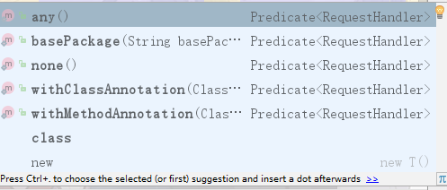
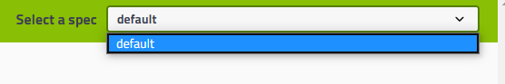
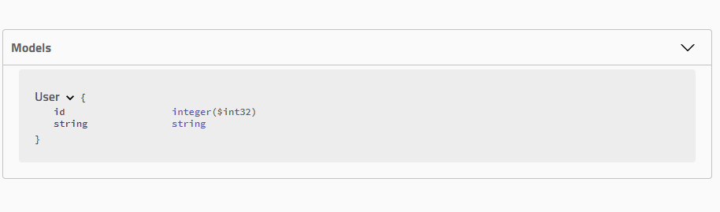

# Swagger

## 1、Swagger是什么

##### 没有Swagger的缺点：

在日常的工作中，我们往往需要给前端（WEB端、IOS、Android）或者第三方提供接口，这个时候我们就需要给他们提供一份详细的API说明文档。但维护一份详细的文档可不是一件简单的事情。首先，编写一份详细的文档本身就是一件很费时费力的事情，另一方面，由于代码和文档是分离的，所以很容易导致文档和代码的不一致。

##### Swagger作用：

那么我们就可以通过**Swagger来自动生成**Restuful API文档

## 2、Swagger的构建

##### 	1）Swagger的一些基础配置

```java
//首先，进行两个包的导入
<dependency>
    <groupId>io.springfox</groupId>
    <artifactId>springfox-swagger2</artifactId>
    <version>2.9.2</version>
</dependency>
<dependency>
    <groupId>io.springfox</groupId>
    <artifactId>springfox-swagger-ui</artifactId>
    <version>2.9.2</version>
</dependency>
//还需要一个配置类，进行Swagger自动配置的开始

@Configuration
@EnableSwagger2   //自动配置的开始
public class SwaggerConfig {
}
```

​	然后就可以通过  主机+端口/swagger-ui.html来进行访问swagger的文档【不过，此文档是默认配置】

##### 	2）自定义Swagger文档

​			1、有关Swagger的基本信息被保存在Docket里面，只需要进行重新构建，并将其注入容器即可

​			2、构建Docket

```java
@Bean
public Docket docket(){
    //还需要构建一个文档描述信息类
    return new Docket(DocumentationType.SWAGGER_2).apiInfo(apiInfo());
}
//创建文档的信息
    public ApiInfo apiInfo(){
        //联系人的方式
        Contact contact = new 			Contact("我","aaa.com","2627492139@qq.com");
        //返回已经创建的文档信息
        return new ApiInfo("Swagger学习文档","这是一个文档，哈哈哈哈哈哈哈","v1.0","http::localhost:8080"
                ,contact,"","",new ArrayList<>());
    }

/*下面是ApiInfo的构造器的参数*/
public ApiInfo(String title, String description, String version, String termsOfServiceUrl, Contact contact, String license, String licenseUrl, Collection<VendorExtension> vendorExtensions) {
        this.title = title;    //文档的标题
        this.description = description;   //文档的描述
        this.version = version;   //文档的版本号
        this.termsOfServiceUrl = termsOfServiceUrl;   //公司或者组织的内部url
        this.contact = contact;  //联系人的信息
    //后面这部分可以不需要去写
        this.license = license;   //表示许可
        this.licenseUrl = licenseUrl;  //许可的url地址
        this.vendorExtensions = Lists.newArrayList(vendorExtensions);
}
```

​			3、这里只是自定义了文档的基本信息

##### 	3）如何定制URL的显示？

​		1、我们有时并不需要显示所有的url【尤其是SpringBoot默认配置的url error的映射】

，这时我们就可以进行选择URL的显示

​		2、代码如下：

```java
@Bean
public Docket docket(){
    //为什么还需要build，因为进行选择api之后，返回的类型已经不是Docket的了，所以需要重新构建为Docket
    return new Docket(DocumentationType.SWAGGER_2).select().apis(RequestHandlerSelectors.any()).build();
}
```

​		3、根据RequestHandlerSelectors方法来进行选择



​		他们分别表示：

​			1）扫描全部：any()

​			2）扫描指定的包：basePackage()

​			3）全部都不添加：none()

​			4）使用类注解来进行扫描添加URL：withClassAnnotation()

​			5）使用方法注解来扫描添加URL：withMethodAnnotation()

​		3、使用path加api来筛选显示请求URL

```java
@Bean
public Docket docket(){
    return new Docket(DocumentationType.SWAGGER_2).select().apis(RequestHandlerSelectors.basePackage("com.test.swagger.swaggerteststudy.controller"))
            .paths(PathSelectors.ant("/user/test01/**")).build();
}
//paths和apis可以一起用，也可以分开用。
```

##### 	4）如何忽略一些请求方法的参数

```java
@Bean
public Docket docket(){
    return new Docket(DocumentationType.SWAGGER_2).ignoredParameterTypes(String.class);
}
/*这里面的Post请求，由于附带了一个String.class类型的参数*/
@RestController
@RequestMapping(value = "/user")
public class MyController {

    @GetMapping(value = "/test01")
    public String test01(){
        return "张三"+"  这是Get请求";
    }

    @PostMapping(value = "/test02")
    public String test02(String username){
        return "你传过来的用户名字："+username;
    }
}
//如果Swagger没有使用ignoredParameterTypes来忽略请求参数，那么请求参数会展示在页面。如果忽略了，就不会进行展示
//【由于可能会在方法参数会写上Session或者Request等敏感信息，所以需要将其忽略【虽然Swagger会将其自动忽略，这里只是举出一个例子】】
```

##### 	5）如何设置是否启动Swagger配置，使其可以在页面访问

​		1、由于环境不同，需要设置不同的Swagger启动状态。在代码开发环境可以进行访问，但是如果已经上线运行了，还可以通过浏览器访问，就不大合适

​		2、通过Profiles来设置展示效果【就是Spring的测试环境的改变来决定是否启动Swagger】

```java
/**
 * 这里用于代表Spring运行时环境
 * 包含一些上下文参数
 */
@Autowired
Environment environment;

/**
 * 名字需要默认
 * @return
 */
@Bean
public Docket docket(){
    //用于将dev，test封装为Profiles
    Profiles profiles = Profiles.of("dev","test");
    //判断运行时环境是否是dev或者是test
    //true就是包含
    //false就是不包含
    boolean flag = environment.acceptsProfiles(profiles);
    //enable判断是否显示页面
    return new Docket(DocumentationType.SWAGGER_2)
            .enable(flag);
}
```

##### 	6）如何设置分组

​		

​		1、上面就是一组【default】，作用就是将不同的URL归到不同的组中，方便查询

​		2、设置分组：只需要注入多个Docket即可

```java
@Bean
public Docket docketUser(){
    Docket docket = new Docket(DocumentationType.SWAGGER_2);
    docket = docket.groupName("用户").select().paths(PathSelectors.ant("/user/**")).build();
    return docket;
}

@Bean
public Docket docketHello(){
    Docket docket = new Docket(DocumentationType.SWAGGER_2);
    docket = docket.groupName("你好").select().paths(PathSelectors.ant("/hello/**")).build();
    return docket;
}
//只需要配置多个Doket，就可以进行设置分组信息
```

##### 	7）实体配置

###### 		1、Swagger可以将我们使用到的实体进行显示，两种方法显示。

​			1）通过入参来进行：这种Swagger并不会直接添加，需要一些注解，才能被添加到Models选项卡里面【可以通过@RequestBody来进行添加】

​			2）通过返回值来进行：这种Swagger可以直接扫描到，并且添加到Models选项卡里面

**这种是直接通过返回值来进行添加的**【问题：如果参数过多，并且没有一定的注释，前端看起来会十分的吃力】【如下图所示】



所以我们可以通过**@ApiModel**来进行一些注释：

```java
@ApiModel(value = "用户实体",description = "user")
public class User {
    //如果参数类型是Integer等一些数值类型，需要设置默认值，否则在参数进行转换的时候，会出现类型转换错误
    @ApiModelProperty(value = "用户id",example = "0")
    private Integer id;

    @ApiModelProperty("用户年龄")
    private String string;
    /*省略setter和getter方法*/
}
/*@ApiModel注解参数的说明：
    用于注解到出入参的类中
    主要有作用的
    	value-字段说明
    	description-详细描述信息
@ApiModelProperty注解参数的说明：
    value–字段说明 
	name–重写属性名字 
	dataType–重写属性类型 
	required–是否必填 
	example–举例说明 
	hidden–隐藏*/
```

进行了注释之后，展示出来的实体效果为

​	

##### 	8）配置全局参数

​	什么是全局参数：比如说一个Token就是一个全局参数

```java
@Bean
public Docket myDocket(){
   Parameter parameter = new ParameterBuilder().name("token")  //参数名字
            .description("这是一个令牌")   //参数描述信息
       		.parameterType("header")  //作为一个请求头参数
       		//还有query  表示请求参数
            .modelRef(new ModelRef("String"))  //类型是什么
            .required(true)  //表示这个令牌是必须被填写的
            .build();
    return new Docket(DocumentationType.SWAGGER_2).globalOperationParameters(Arrays.asList(parameter));
}
```

##### 	9）接口和参数配置

###### 	1、@ApiImplicitParams注解

​	value--只是用来包含多个@ApiImplicitParam注解

```java
@ApiImplicitParams(value = {
        @ApiImplicitParam(name = "username",value = "用户名"),
        @ApiImplicitParam(name = "password",value = "密码")
})
public String test01(String username){
    return "张三"+"  这是Get请求";
}
```

###### 	2、@ApiImplicitParam：注解方法

​	name--参数名【可以写与参数不同的名字，但是最好不要】

​	value–参数说明 
​	dataType–数据类型

​	defaultValue--默认参数

​	paramType–参数类型 
​	example–举例说明

​	required--表示是否必须填写


###### 	3、@Api：作用于类

​		用于表示这个类是Swagger的资源

​		tags--表示说明，如果多个值，就会生成多个list

​		value--也是说明，可以使用tags进行替代

​		

​	

```java
@Api(tags = "用户相关的请求",value = "请求参数")
@RestController
@RequestMapping(value = "/user")
public class MyController {
}
```

​	4、@ApiOperation

​	用于描述方法，表示一个Http请求的操作

​	value--用于方法描述【请求的描述信息】

​	notes--用于提示内容

​	tags--可以重新分组

​	value作用图片：


​	tags作用：会生成多个URL副本

​	

```java
@ApiOperation(value="获取用户信息",tags = {"copy用户信息","这是另一个"},notes = "注意一下，这是notes内容")
@GetMapping(value = "/test01")
public String test01(String username){
        return "张三"+"  这是Get请求";
}
```

###### 	5、@ApiParam

​	name--参数名

​	value--参数说明

​	required--是否必须填写


```java
@ApiOperation(value="获取用户信息",notes = "注意一下，这是notes内容")
@GetMapping(value = "/test01")
public String test01(@ApiParam(name = "username",value = "用户名",required = true) String username){
    return "张三"+"  这是Get请求";
}
```

###### 	6、@ApiModel：作用与类

​	1）作用：表示对类进行说明，用于参数，用实体类接收

​	value–表示对象名 
​	description–描述

###### 	7、@ApiModelProperty

​	1）用于方法或者字段，表示对model属性说明或者数据操作变更

value--字段说明

name–重写属性名字 
dataType–重写属性类型 
required–是否必填 
example–举例说明 
hidden–隐藏

###### 	8、6和7注解要联合使用

```java
@ApiModel(value = "用户实体",description = "user",discriminator = "id")
public class User {
    @ApiModelProperty(name="id",value = "用户id",example = "0")
    private Integer id;

    @ApiModelProperty(value = "用户年龄")
    private String string;
    /*省略setter和getter方法*/
}
//注意：如果是入参的话，一定要使用@RequestBody来声明，Swagger才能扫描到，并添加到Model里面
@ApiOperation(value = "测试User的@ApiModel注解")
@PostMapping("/test03")
public String testUser(@RequestBody User user){
    return "success";
}
```

​	

###### 	9、@ApiIgnore

​	作用于类或者方法上，使得其不再swagger的页面上显示出来

注意：上述8中常用注解的参数并没有全部给出，只是给出了常用的一部分

##### 	10）NumberFormatException异常

​	由于Swagger进行类型转换的时候，会将**example【注解的一个参数】**，进行一个类型转换，它的**默认值为“”**，如果你当时的字段类型为**int等数值类型**，那么在进行转换的时候就会出现类型转换的异常

```java
//AbstractSerializableParameter类中的方法
@JsonProperty("x-example")
public Object getExample() {
    if (this.example == null) {
        return null;
    } else {
        try {
            if ("integer".equals(this.type)) {
                return Long.valueOf(this.example);
            }

            if ("number".equals(this.type)) {
                return Double.valueOf(this.example);
            }

            if ("boolean".equals(this.type) && ("true".equalsIgnoreCase(this.example) || "false".equalsIgnoreCase(this.defaultValue))) {
                return Boolean.valueOf(this.example);
            }
        } catch (NumberFormatException var2) {
            LOGGER.warn(String.format("Illegal DefaultValue %s for parameter type %s", this.defaultValue, this.type), var2);
        }

        return this.example;
    }
}
```

​	所以，要解决这个问题：

​	1、要么设置example的值

​	2、换成高版本的swagger-models的包【比1.5.0高即可】

​	这是高版本的源码：

```java
//1.5.22的swagger-models的包的AbstractSerializableParameter类中的源码
@JsonProperty("x-example")
public Object getExample() {
    //这里会判断是否为空串 && 是否为null，来判断是否进行类型转换
    //而低版本的并不是判断是否为空串，所以可能会导致类型转换异常
    if (this.example != null && !this.example.isEmpty()) {
        try {
            if ("integer".equals(this.type)) {
                return Long.valueOf(this.example);
            }

            if ("number".equals(this.type)) {
                return Double.valueOf(this.example);
            }

            if ("boolean".equals(this.type) && ("true".equalsIgnoreCase(this.example) || "false".equalsIgnoreCase(this.defaultValue))) {
                return Boolean.valueOf(this.example);
            }
        } catch (NumberFormatException var2) {
            LOGGER.warn(String.format("Illegal DefaultValue %s for parameter type %s", this.defaultValue, this.type), var2);
        }

        return this.example;
    } else {
        return this.example;
    }
}
```